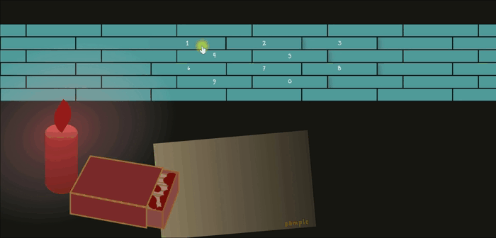
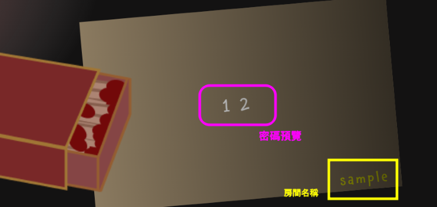

# Memories 回憶相簿
## 專案緣起與介紹
在慶生、紀念日、婚禮等場合，人們常會將過往的照片集合在一起，用照片回顧彼此間的歷史。但如果只是單純將照片集結在一起，好像有點太單調，於是便將相簿與畫廊結合，做出帶有一點互動性的電子相簿網站。

進入相簿前，使用者會先來到一個小畫廊。展示在畫廊中的畫一開始什麼都沒有，只是一張白紙，但每當使用者瀏覽完一本相簿，畫布上就會出現與相簿主題相關的圖畫，例如山、海洋、羽球等。圖畫隨著瀏覽的相簿增加，一層一層堆疊，彷彿在用回憶作畫般。當瀏覽完最後一本相簿時，使用者便能在畫廊中看見由一段一段回憶堆疊而成的獨一無二畫作。

 

### [***點這裡看網站！](https://ansticefish.github.io/memories/#/)

 

## 進入相簿的方法
 

#### 1. 點選登入頁面的火柴盒讓牆轉向，選擇想進入的相簿(以蠟燭表示)
 

 

#### 2. 點擊牆面上的數字輸入六字密碼，若密碼正確，就能進入相簿中
 

 

#### 3. 可以從火柴盒旁的紙張確認相簿的名稱與輸入的密碼
 

### <strong>Sample相簿的密碼: 123456</strong>

 

## 版本區別
最一開始只是為了做電子相簿給朋友，因此初版的網站並沒有設計登入頁面，且資料直接存在網站中。後來為了將相簿模板化，與增加使用的流暢度，便做了以下優化：
### 1. 增加登入頁面，使用者需要輸入相簿的密碼才能瀏覽相簿
### 2. 以firebase存取資料，並依據使用者的登入狀態回傳對應的資料
### 3. 預先下載所有照片，解決初版相簿換頁時，照片轉換不順暢的問題：

 

#### 在初版的網站中，資料是一頁一頁放入的。當使用者換頁時，會先將原本的資料清空，再放入對應的資料，因此在換頁時，由於相片下載、置換速度太慢，使用者會看到前一頁的照片

 

#### 新版網站改為依據照片數量，一次將所有的照片下載並放置到模板中。在照片下載時，先以spinner取代相簿畫面，並用@load偵測相片下載進度。最後再使用v-show，依據使用者的操作顯示相對應的畫面，因此能很流暢地換頁

 

## 技術與環境
使用vue2作為網站框架，再搭配vue router控制路由。資料部分則以firebase存取資料，並藉由vuex統一控管網站資料。目前網站主要為桌機使用者設計。

 

## 開發重點與設計
### 1. 以vue製作可重複利用的相簿、首頁模板，方便未來增修功能以及優化介面設計
### 2. 將資料存入firebase，透過firebase動態調動資料，使資料與模板脫離，也方便增修資料
### 3. 使用vuex統一管理網站資料以及記錄使用者瀏覽的進度，讓首頁依進度做出變化
### 4. 使用vue router控制使用者的權限，在未登入狀態下，使用者無法進入相簿，且當畫面重整時，會自動導回登入頁面